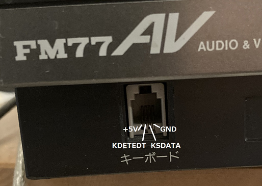
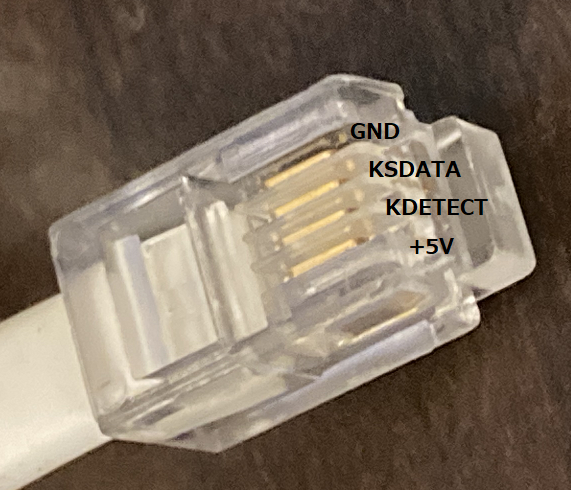
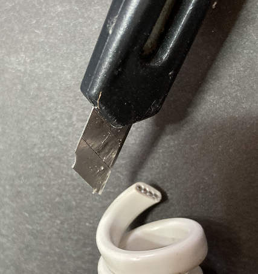
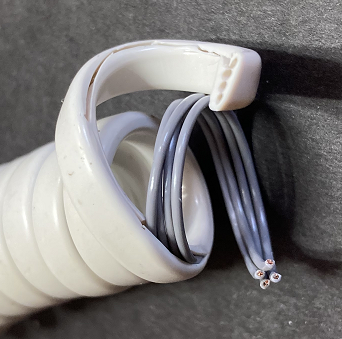
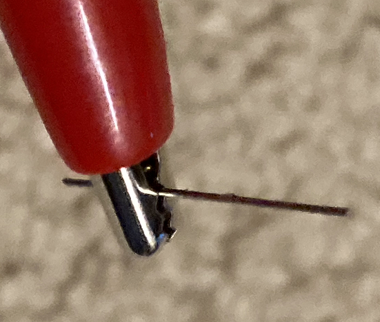
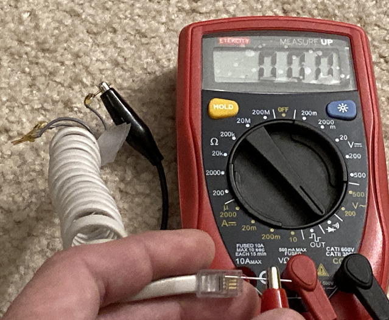
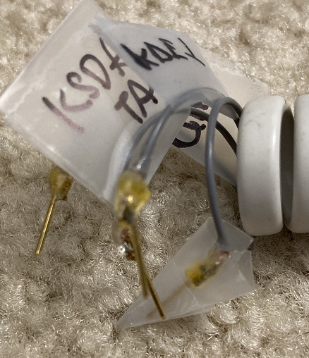
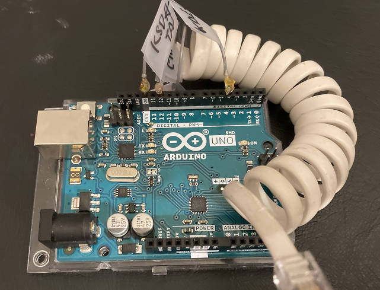

# Typing into FM77AV with Arduino UNO without making a PCB over a wired connection
# PCB無しでArduino UNOでFM77AVにキーコードを有線で送る

2023/11/25

## はじめに
## Introduction

多分、これがキーボードが無いFM77AVにタイプする最も安くて簡単な方法だと思います。従来の方法では、最低でもPCBを作って部品をはんだ付けする必要がありましたが、普通の人はPCBを作る段階で敷居が上がってしまいました。

今回の新しい方法では、はんだ付け不要までは簡単にならなかったのですが、FM77AVから出るキーボード線のワイヤーを直接Arduino UNOに接続するので、PCBを作る必要がありません。

必要なものは、

1. Arduino UNO (R3で確認)
2. 切ってもいいRJ11(4P4C)ケーブル
3. Arduinoに刺せるピン3本
4. テスタ
5. カッター
6. はんだ付け装備
7. Arduinoの母艦になるPCと
8. ターミナルソフト(TeraTermみたいなの)

なお、手元のFM77AVで実験しましたが、FM77AV40は引っ張り出してくるのが大変なのでまだ実験してなくて、そもそもFM77AV20, AV20EX, AV40EX, SXは持ってないので試してないのですが、信号は同じだということなので、誰かケーブルの作り方をどこかに書いてくれることを期待してます。

Probably it is the least demanding (in terms of soldering and electronics skills) option to send keyboard signal to an FM77AV that is missing a keyboard.  The existing method needed a PCB minimum.  For majority of people, ordering PCB is a big obstacle.  Many people probably don't know where to order a PCB just like me a few years ago.  Well, it was until 2016 for me.

The new method still requires some soldering, but no PCB needed.  You directly connect wires from the FM77AV keyboard connector to Arduino.

All you need are:

1. Arduino UNO (I have confirmed with my UNO R3)
2. A RJ11(4P4C) cable that you don't mind cutting.
3. 3 pins that can be inserted to Arduino connector
4. Multimeter
5. Box cutter
6. Soldering equipment
7. A PC that can program Arduino
8. Terminal software (such as TeraTerm)

## Available FM77AV Keyboard Emulators
## 現在あるFM77AVキーボードエミュレータ

もしも今キーボードが無いFM77AVがあったとしたら、キーボードにキーコードを送る方法はいくつかあります。

やや値段が張りますが、確実ではんだ付けとか工作が一切不要な方法は、クラシックPC研究会の変換アダプタがあります。(https://classicpc.org/category/item/itemgenre/fm77/) 工作やはんだ付けに自信の無い人は、買ってしまいましょう。

FM77AV, AV20, AV40だったら、我がキーボードエミュレータを使ってPCからArduino経由で赤外線キーボード信号を送ることができます(https://github.com/captainys/FM/tree/master/7/FM77AVKeyboard)。難点は、AV20EX, AV40EX, SXに対応できない点です。母艦が必要というのは難点とも見れますが、僕にしてみるとFM77AVのキーボードを置くスペースが無くても済むのでメリットだと思うんですが。テキストファイルを代わりにタイプさせるとかもできるし。また、電子工作が苦手な人はPCBを作ったり部品を発注したりがちょっと難しいかもしれません。なお、ヤフオクに売りに出してみたことがありましたが誰も買ってくれませんでした。

電子工作に自信のある人だと、Old68funさんが、USBキーボードからFM77AVに接続するアダプタの開発に成功されているようです。(https://flexonsbd.blogspot.com/search/label/USB%E3%82%AD%E3%83%BC%E3%83%9C%E3%83%BC%E3%83%89) が、Arduinoのような箱から出してUSBでつなげたらいきなりプログラミングできてしまうマイクロコントローラよりもやや敷居の高いマイクロコントローラを使っているので、ちょっと自作には高い電子工作レベルが必要鴨しれません。

そして、今回、新たな方法は、Arduino UNOにFM77AVのキーボードコネクタピンを直結する方法で、PCBを作らなくてもよく、おそらく自作で対応する方法の中では最も電子工作レベルの低い方法と思います。手元にFM77AV20EX, 40EX, SXが無いので、その3機種での動作は確認できないのですが、信号は同じだということなので、誰かがコネクタの作り方を解明してくれればまったく同じArduinoのプログラムで対応できるはずです。

If you own an FM77AV but missing a keyboard, there are several methods for sending keyboard signals to FM77AV.

A bit pricy, but most certain and not requiring soldering or fabricating is to buy a keyboard converter from ClassicPC.org.  (https://classicpc.org/category/item/itemgenre/fm77/)  If you are not so confident in soldering, but have money, go for it.  Especially, now Japanese yen is incredibly cheap (as of November 2023).

If your unit is FM77AV (1st gen), FM77AV20, or FM77AV40, you can use my keyboard emulator to send infra-red keyboard signal from your PC via Arduino.  (https://github.com/captainys/FM/tree/master/7/FM77AVKeyboard)  A drawback is it does not support AV20EX, AV40EX, and AV40SX because these models do not have an infra-red keyboard port.  Some says needing a PC is a drawback, but to me, I can save space on my desk exclusively for FM77AV keyboard.  I can also send a text file via the keyboard signal.  I think it is not that a drawback.  Another problem can be even if it is very easy to make the shield, it requires a PCB.  I once put some on Yahoo! Auction, but nobody bid for it :-P

If you have a high skill level in electronics, Old68fun succeeded in fabricating an adapter for connecting a USB keyboard to FM77AV.  (https://flexonsbd.blogspot.com/search/label/USB%E3%82%AD%E3%83%BC%E3%83%9C%E3%83%BC%E3%83%89)  It requires a micro-controller that is not as easy to program as Arduino.  It can be a bit of a challenge to mid-levels in electronics (like myself).

And, this time, I made a new method.  This method probably is the least demanding in terms of electronics and soldering skill.  This method directly connect FM77AV keyboard connector pins to Arduino.  Since I don't have FM77AV20EX, 40EX and 40SX, I cannot test on those models, but I hear that all those models take the same keyboard signal.  So, if someone figure how to fabricate a cable, the same Arduino program should work.

## FM77AV Keyboard Connector
## FM77AV キーボードコネクタ

FM77AVのキーボードコネクタは、次のようになっています。

RJコネクタのナンバリングでは、右から1,2,3,4番ピンということになっているようです。FM Techknowの回路図376ページが何と言おうと、テスタで計った結果1番ピンはGNDでした。というか、ナンバリングが4ピンの場合だけ違うの鴨しれません。

FM77AV Keyboard Connector is like the above image.

Conventional RJ connector pin-numbering convention looks to be the right-most pin is number 1.  The +5V and GND on the above image was a result from my multimeter.  No matter what FM Techknow pp.376 says, number 1 pin is GND, and 4 pin is +5V.  Or, maybe pin numbering is different for 4P4C cable?  I don't know.

これを、ケーブル側から見るとこのようになります。

If you look at the cable-side, the pin assignments are as follows.

## ステップ1 ケーブルの皮むき
## Step 1 Peeling Cable Skin

最初にすることは、4P4Cケーブルを適当な長さのところで切断、皮むきして、中のワイヤーを弾き出すことです。運が良ければ、ワイヤーに色がついているでしょう。僕のように、大学の電気製品の墓場から拾ってきた電話の受話器用ケーブルだと全部グレーだったりするかもしれません。

カッターを使って、外側の皮をむいて中の4本のワイヤーを引き出します。10cmぐらい引き出すと良いでしょう。

<H3><B>ただし、このときカッターを正しく使うことが出来ない人は、ここで打ち切ってください！手を切っても僕はなんにも責任を負いません。自己責任でやってください。</B></H3>

First step is to cut a RJ11 (4P4C) cable at an appropriate length, and then peel off the outer skin to expose four inner wires.

Use a box cutter to cut outer skin.  I recommend to pull out about four inches of inner cables.  But,

<H3><B>If you do not know how to use a box cutter correctly stop here, and do not attempt.  If you get injured while peeling off the outer skin, I won't be responsible for the damage.  Please do it on your own risks!</B></H3>

中のワイヤーを引き出したら、そのうちの先端3～5mm程度内側の皮もむいて、銅線を露出させます。内側の銅線を切らずに外のカバーだけ切るのが結構大変ですが、ここは頑張ってやります。<B>繰り返しますが、工具を正しく使えない人はここで断念してください。</b>

Once inner cables are pulled out, peel off inner skin of each wire about a quarter inch.  Cutting cover without damaging inside copper wire is actually not very easy.  But, do your best.  <B>If you cannot use tools safely, please do not attempt.</b>

## ワイヤーの識別
## Identifying Wires

次に、どのワイヤーがどのピンにつながってるか識別します。ここは、テスタを使います。なお、テスタにワニ口クリップが無い場合は相当苦労するのでワニ口クリップを確保することをお勧めします。

上に挙げた写真を参考にして、どのワイヤーがGND, KSDATA, KDETECT, +5Vであるかを識別して、テープなどでマークをつけてください。GNDと+5Vを間違うと大変なことになるので、絶対間違えないようにしてください。

なお、テスタのプローブが太い場合は、下の写真のように細い針金をワニ口クリップに咥えさせてコネクタのプラスチックの隙間に差し込むという手が使えます。

Then, you need to identify which wire is connected to which pin with your multimeter.  If you do not have alligator clips for your multimeter probes, it gets very difficult.  I suggest you to get a pair of multimeter alligator clips.

Referring to the picture above, mark four wires GND, KSDATA, KDETECT, or +5V.  If you mix up +5V and GND, you may end up frying your FM77AV.  So, the identification is extremely important.  Do not mix up!

If your tester probe is too thick to touch metal pins in the RJ connector, you can hold a thin wire, like a paper clip with one of the alligator clips and insert it to the plastic gap of RJ connector like the picture above.

## ピンのはんだ付け
## Soldering Pins

ワイヤーを識別したら、ワイヤーに固いピンをはんだ付けします。+5Vは使わないので、GND, KDETECT, KSDATAの3本の先にピンをつけてください。写真だとちょっとわかりにくいですが、こんな感じにします。なお、根元が弱そうだったのでエポキシ樹脂で補強してありますが、しなくても多分大丈夫です。

多分正式には、こんな感じのピン https://www.digikey.com/en/products/detail/te-connectivity-amp-connectors/1658670-1/1279941 にクリンプするのが正しいんだと思うんですが、僕はクリンプする道具を持ってません。。。。どこかにあったんだよなあ。どこにやったっけ?

Once you identify wires, then solder hard pins on GND, KDETECT, and KSDATA wires.  You don't need +5V.  It is a bit hard to see from the picture, but it should become like the following image.  I put some epoxy resin to support strength where the pin is connected to the wire, but it is optional.

Probably, it is better to use a pin like https://www.digikey.com/en/products/detail/te-connectivity-amp-connectors/1658670-1/1279941  But, I don't have a crimp tool.  .... I think I do.  Where did I misplace it????

## ピンの再チェック
## Re-testing the Pins

ピンを取り付けたら、再度接続が間違ってないか確認しましょう。+5Vのワイヤーだけピンがつながってなくて、GND, KDETECT, KSDATAの3本のワイヤーにピンがついてて、正しくラベルがついていることを確認してください。

繰り返しますが、+5VとGNDを間違ってると最悪貴重なFM77AVが煙を吹く危険があるので、この間違いが絶対無いようにしてください。

そして、+5Vのワイヤーは切ってしまうか、テープで巻いてうっかり何かに接触しないようにしてしまいましょう。

Once you attach pins to wires, re-check the connection.  You are supposed to have pins attached to GND, KDETECT, KSDATA, and no pin attached to +5V.  Also check your labels.

I repeat.  Do not mix up +5V and GND.  Connecting +5V to GND directly might fry your FM77AV.

Once you triple-checked wire labels, you don't need +5V.  You can cut your +5V wire or cover with a plastic tape so that it will not accidentally touch another pin.

## Arduino用プログラムのインストール
## Install Program to Arduino

Arduino IDEを使って、

https://github.com/captainys/FM/tree/master/7/FM77AVKeyboard/arduino/IREmitter

ここにあるプログラムをArduino UNOにアップロードしてください。IREmitterとありますが、最近有線接続にも対応しました。

From Arduino IDE, upload the following program to Arduino UNO.

https://github.com/captainys/FM/tree/master/7/FM77AVKeyboard/arduino/IREmitter

Although the file name says IR Emitter, recently it supported wired connection, too.

## 配線
## Connecting Wires to Arduino

Arduinoにプログラムをインストールしたら、

GNDワイヤーをArduinoのGND
KSDATAワイヤーをArduinoの12ピン
KDETECTワイヤーをArduinoの4ピン

に接続してください。

Once the program is uploaded to Arduino, connect:

GND wire to Arduino GND pin
KSDATA wire to Arduino 12 pin
KDETECT wire to Arduino 4pin

## FM77AVに接続
## Connect to FM77AV

あとは、RJコネクタをFM77AVに接続して、ターミナルソフト(TeraTermとか)を開きます。ArduinoのCOMポートが何番か調べ方がわからない人はDuck Duck Goに聞いてください。

ターミナルソフトで、ArduinoのCOMポートに115200bpsで接続して、タイプすると、タイプした文字がFM77AVにも現れるはずです。

Then connect the RJ connector to FM77AV, open a terminal (such as TeraTerm), and connect to the Arduino COM port at 115200bps.  If you do not know how to find the COM port assigned to Arduino, ask Duck Duck Go.

Then what you type into the terminal will appear on FM77AV.

## FM77AVキーボードエミュレータを使う
## Using FM77AV Keyboard Emulator

ターミナルからでも使えますが、それだとゲームで使うにはいまいちです。フルにタイプしたい場合は、ターミナルソフトの代わりに我がFM77AV Keyboard Emulator (https://github.com/captainys/FM/tree/master/7/FM77AVKeyboard) を使うと、大概のゲームには間に合います。CMakeでビルドする必要がありますが、そんなに難しくないので試してみてください。

This can be used from a terminal program.  But, it is not good for playing games.  For playing games, if you use my FM77AV Keyboard Emulator (https://github.com/captainys/FM/tree/master/7/FM77AVKeyboard) instead of a terminal program, you can comfortably play games.  You need to build it with CMake, but it is not too difficult.  Please try if you really want to play games using this program.

